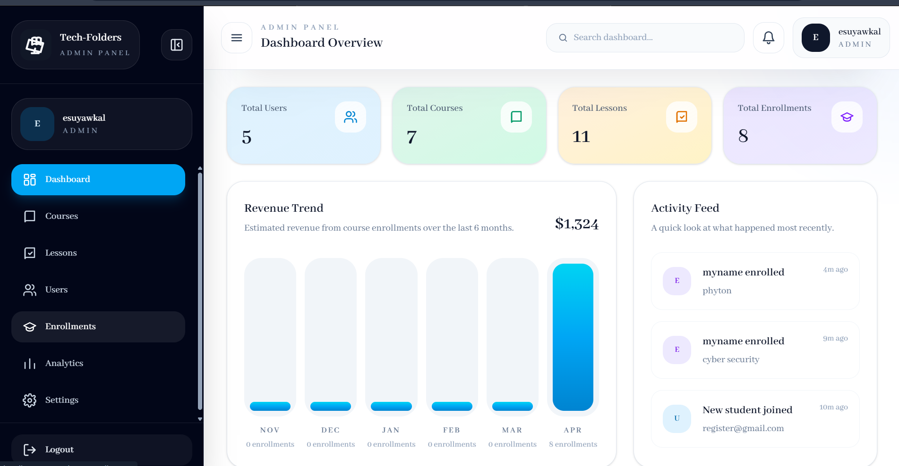
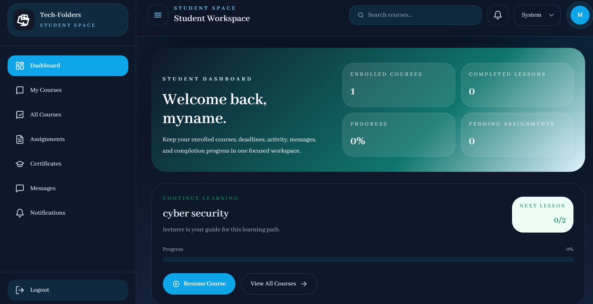
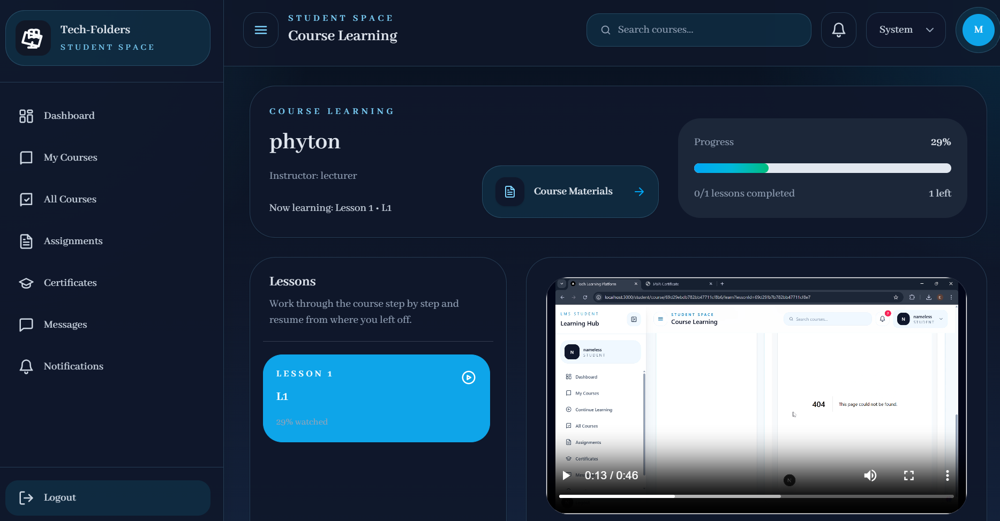

# learning-management-system
A full-stack Learning Management System with role-based dashboards for Admin, Instructor, and Students.

📸 Preview

  
    
     
     
     
    

✨ Features
🔐 Auth (JWT + Google OAuth)
👥 Roles: Admin / Instructor / Student
📚 Course & Lesson Management
🎥 Video Learning + Progress Tracking
💳 Payments(chapa test mode) & Enrollment
📊 Analytics Dashboards
💬 Messaging System
📝 Certificates
🛠️ Tech Stack
Frontend: Next.js, React,Tailwind cSS
Backend: Node.js, Express
Database: MongoDB

⚙️ Setup
# clone
git clone https://github.com/Esuyawkal1/learning-management-system.git
# backend
cd backend && npm install && npm run dev
# frontend
cd frontend && npm install && npm run dev

🔑 Env
PORT=5000
MONGO_URI=mongodb://localhost:27017/tech-learning
JWT_SECRET=supersecretkey
CLIENT_URL=http://localhost:3000

📄 License
MIT
